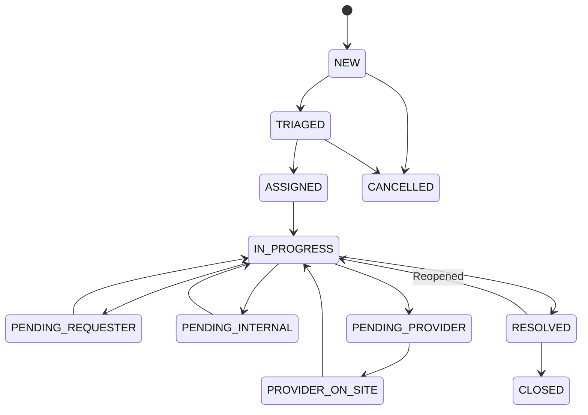
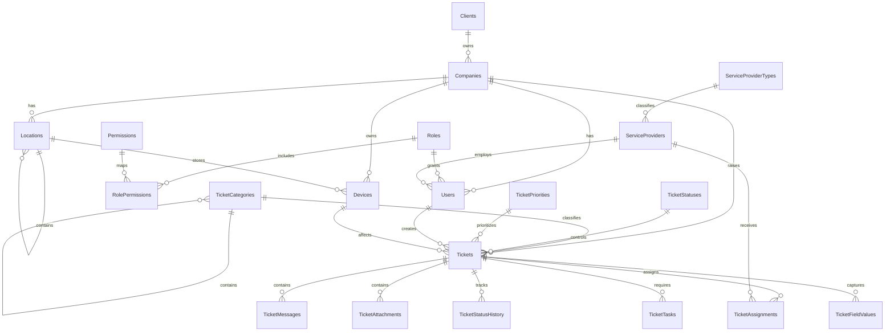

# IT Service Management System

## Master Product Requirements and Technical Specification

| Document Item | Value |
|---|---|
| Project | IT Service Management System |
| Document Type | Product Requirements Document (PRD), Software Requirements Specification (SRS), and Technical Blueprint |
| Version | 1.0 |
| Status | Approved planning baseline; implementation not started |
| Target Platform | Responsive web application |
| Backend | PHP |
| Database | MySQL |
| Primary Language | English; Arabic-ready user interface |
| Intended Users | Employees, IT support staff, managers, administrators, client users, and external service providers |

---

## 1. Executive Summary

The IT Service Management System is a secure, responsive PHP and MySQL web application for receiving, assigning, tracking, resolving, and reporting IT and internal service requests.

The system will replace informal requests made through calls, chat messages, or verbal communication with a controlled ticket workflow. It will support common cases such as:

- Computer, laptop, and device problems
- Internet and network problems
- Email problems
- Printer problems and printer installation
- Preparing a new computer for an employee
- Creating a new email account or system user
- Employee onboarding
- Employee resignation or offboarding
- User access and password requests
- Software installation and configuration
- Electrical and other internal facility problems
- General requests that do not fit a predefined category

The platform will maintain a complete history of every ticket, including messages, attachments, status changes, internal assignments, external provider assignments, resolution details, and timestamps. It will also track companies, users, locations, devices, and service providers.

The initial implementation should focus on a reliable minimum viable product (MVP), while keeping the architecture ready for approvals, service-level agreements, automated notifications, configurable forms, and future integrations.

---

## 2. Product Vision

Create one trusted place where every IT or internal service request can be submitted, understood, assigned, completed, audited, and measured.

### 2.1 Product Goals

1. Make it easy for a user to report a problem or request a service.
2. Ensure that no request is lost or forgotten.
3. Give support staff a clear queue of work and priorities.
4. Record responsibility, progress, and resolution for every ticket.
5. Support both internal teams and external service providers.
6. Track the relationship between users, devices, locations, and tickets.
7. Standardize onboarding, offboarding, new-device, and account-creation work.
8. Provide managers with accurate workload, response-time, and resolution reports.
9. Protect confidential employee, access, and offboarding information.
10. Provide a clean foundation for future automation and integrations.

### 2.2 Success Measures

- Percentage of requests submitted through the system
- First-response time by priority
- Average and median resolution time
- Percentage of tickets resolved within target
- Number of overdue and unassigned tickets
- Reopened-ticket rate
- Ticket volume by category, company, location, and agent
- Device-related incident frequency
- Onboarding and offboarding checklist completion rate
- User satisfaction after resolution, if the survey feature is enabled

### 2.3 Non-Goals for the MVP

The following are not required in the first release unless explicitly approved:

- Full ITIL change-management and problem-management modules
- Procurement, inventory accounting, or depreciation
- Vendor contract and invoice management
- Live chat
- Automatic ticket creation from inbound email
- Native mobile applications
- Remote-control software
- Full HR or payroll functionality
- Advanced workflow designer

---

## 3. Scope and Operating Model

### 3.1 Supported Organization Modes

The data model supports both of the following modes:

1. **Internal mode:** employees submit requests for the organization itself. Internal tickets have no client company reference.
2. **Multi-company support mode:** the support organization manages tickets for multiple clients and their companies.

The first deployment may use only internal mode. The client, company, and provider structures remain available so the system can grow without redesigning the database.

### 3.2 Ticket Scope

Every ticket has one scope:

| Scope | Meaning | Company Requirement |
|---|---|---|
| `INTERNAL` | Request belongs to the operating organization | `CompanyID` must be empty |
| `CLIENT` | Request belongs to a client company | `CompanyID` is required |

The parent client must be derived through `Companies.ClientID`. `ClientID` must not be duplicated in the `Tickets` table.

### 3.3 Ticket Kind

Every ticket should also identify the nature of the work:

| Kind | Meaning | Typical Examples |
|---|---|---|
| `INCIDENT` | Something is broken or unavailable | Internet down, printer error, email not working |
| `SERVICE_REQUEST` | A user needs a standard service | New email, printer setup, software installation |
| `ONBOARDING` | Services required for a new employee | User account, email, computer, permissions |
| `OFFBOARDING` | Services required when an employee leaves | Disable access, collect devices, mailbox handling |
| `GENERAL_REQUEST` | Other internal or facility request | Electricity, furniture, general maintenance |

`TicketScope` and `TicketKind` solve different problems and must both be stored.

---

## 4. Stakeholders and User Roles

### 4.1 Stakeholders

- Business owner or system sponsor
- IT support manager
- IT support agents and technicians
- Employees and requesters
- Client company administrators and users
- Facility or operations team
- External service providers
- Security and audit personnel
- Database and application administrators

### 4.2 User Types

| User Type | Organization Link | Description |
|---|---|---|
| `INTERNAL` | No company or provider | Employee, support agent, manager, or system administrator |
| `CLIENT` | Exactly one company | User who belongs to a supported client company |
| `SERVICE_PROVIDER` | Exactly one provider | External provider manager or technician |

Only one organization reference is allowed for each user.

### 4.3 Recommended Roles

| Role | Main Responsibility |
|---|---|
| `SYSTEM_ADMIN` | Full configuration, security, user, and system access |
| `SUPPORT_MANAGER` | Manages queues, assignments, priorities, escalations, and reports |
| `SUPPORT_AGENT` | Works on assigned or permitted tickets |
| `INTERNAL_USER` | Creates and follows personal or permitted internal requests |
| `CLIENT_ADMIN` | Manages users and views permitted tickets for one client company |
| `CLIENT_USER` | Creates and follows permitted tickets for one client company |
| `PROVIDER_MANAGER` | Manages tickets assigned to one service provider |
| `PROVIDER_TECHNICIAN` | Updates work assigned to one service provider |
| `AUDITOR` | Read-only access to permitted records and history |

### 4.4 Permission Matrix

| Capability | Admin | Support Manager | Support Agent | Requester | Client Admin | Provider User | Auditor |
|---|:---:|:---:|:---:|:---:|:---:|:---:|:---:|
| Configure system lists | Yes | Limited | No | No | No | No | No |
| Manage all users | Yes | Limited | No | No | Company only | Provider only | No |
| Create a ticket | Yes | Yes | Yes | Yes | Yes | No by default | No |
| View all internal tickets | Yes | Yes | By queue/assignment | Own/permitted | No | No | Read only |
| View client-company tickets | Yes | Yes | By permission | No | Own company | Assigned provider only | Read only |
| Assign internal users | Yes | Yes | If granted | No | No | No | No |
| Assign service providers | Yes | Yes | If granted | No | No | No | No |
| Add internal notes | Yes | Yes | Yes | No | No | Provider update only | No |
| Change ticket status | Yes | Yes | Yes | Limited | Limited | Assignment status only | No |
| Close a ticket | Yes | Yes | If granted | Confirm/reopen only | Confirm/reopen only | No | No |
| View reports | Yes | Yes | Personal/team | Personal | Company | Provider | Read only |

Final permissions must be implemented through role-based access control and checked on every server-side action. Hiding a button in the browser is not a security control.

---

## 5. Functional Modules

### 5.1 Authentication and Account Security

The system must provide:

- Secure sign-in and sign-out
- Password hashing using PHP's current secure password API
- Password reset with expiring, single-use tokens
- Optional forced password change on first login
- Account activation and deactivation
- Session expiration and secure session rotation
- Failed-login throttling and temporary lockout
- Last-login recording
- Optional multi-factor authentication in a later phase
- Audit records for security-sensitive actions

### 5.2 Dashboard

The dashboard content must depend on the user's role.

Support dashboards should show:

- New tickets
- Unassigned tickets
- My assigned tickets
- Team or queue tickets
- Critical and high-priority tickets
- Tickets waiting for requester, internal team, or provider
- Overdue tickets
- Recently updated tickets
- Tickets resolved today
- Workload by agent and category

Requester dashboards should show:

- My open requests
- Requests waiting for my reply
- Recently resolved requests
- A prominent **Create Request** action

Provider dashboards should show only tickets assigned to their provider organization, scheduled visits, overdue provider actions, and completed assignments.

### 5.3 Client and Company Management

The system must support:

- Creating and editing client groups
- Creating one or more companies under each client
- Activating or deactivating clients and companies without deleting history
- Maintaining contact and address information
- Filtering reports by client and company
- Preventing client users from crossing company boundaries

### 5.4 User and Role Management

Administrators must be able to:

- Create internal, client, and provider users
- Assign one active role to a user in the MVP
- Change role or organization link with validation
- Activate or deactivate an account
- Reset a password without viewing it
- Search by name, email, company, provider, department, or role
- View a user's assigned devices and ticket history when permitted

User accounts must normally be deactivated instead of deleted so historical references remain valid.

### 5.5 Location Management

Locations must support a hierarchy, for example:

```text
Head Office
└── Building A
    └── Second Floor
        └── Finance Department
            └── Office 205
```

Each location may represent a branch, building, floor, department, room, warehouse, or other defined type. Client locations require a company. Internal locations have no company.

### 5.6 Device and Asset Management

The system must store:

- Asset tag
- Serial number
- Device type and lifecycle status
- Manufacturer and model
- Device name and network hostname
- Operating system
- IP and MAC addresses when applicable
- Assigned user
- Current location
- Purchase and warranty dates
- Notes
- Related ticket history

The MVP stores the current user and location. A later phase may add immutable assignment and movement history.

### 5.7 Ticket Management

Users must be able to create a ticket by selecting a category or service, entering the required information, and optionally adding files.

Core ticket capabilities:

- Unique public ticket number
- Scope and kind
- Company, requester, and creator
- Category and subcategory
- Subject and detailed description
- Location and optional device
- Impact, urgency, and priority
- Current status and responsible internal user
- Due date and service targets
- Messages and internal notes
- Attachments
- Internal and external assignments
- Complete status and assignment history
- Resolution summary and close timestamps
- Search, filtering, export, and reporting

### 5.8 Service Provider Management

The system must support:

- Provider types such as electrical, network, printer, hardware, and facility maintenance
- Provider organizations and contacts
- Provider users
- Assignment of a ticket to a provider
- Provider reference number
- Acceptance, rejection, scheduling, arrival, progress, and completion
- Provider completion notes and optional cost
- Strict provider-level ticket isolation

Contract and invoice management are outside the MVP.

### 5.9 Notifications

The application must create in-app notifications for important events. Email notifications may be enabled when SMTP configuration is available.

Recommended events:

- Ticket created
- Ticket assigned or reassigned
- New public reply
- Requester information required
- Priority increased to high or critical
- Status changed to resolved or closed
- Provider visit scheduled
- Ticket approaching or exceeding due time
- Ticket reopened

Notification delivery failures must not roll back the ticket transaction. They should be logged and retried when a background queue is introduced.

### 5.10 Search, Filters, and Saved Views

Users must be able to search by ticket number, subject, requester, email, device asset tag, serial number, location, company, provider reference, and message text when authorized.

Common filters:

- Status
- Priority
- Category
- Kind and scope
- Company and client
- Location
- Assigned agent
- Assigned provider
- Created, due, resolved, or closed date range
- Overdue state
- Has attachments

---

## 6. Service Catalog and Request Types

The following catalog is the recommended initial seed. Administrators must be able to activate, deactivate, rename, or reorder categories without changing historical tickets.

### 6.1 IT Incidents

| Category | Required or Important Information | Device Link | Location | Provider Allowed |
|---|---|:---:|:---:|:---:|
| Computer or Device Problem | Symptoms, affected user, asset, when it started, screenshots | Recommended | Optional | Yes |
| Internet or Network Problem | Location, wired/Wi-Fi, affected users, error, outage scope | Optional | Required | Yes |
| Email Problem | Affected email, error message, send/receive/both, device | Optional | Optional | Yes |
| Printer Problem | Printer, workstation, error, network/USB, affected users | Recommended | Required | Yes |
| Software or Application Problem | Application, version, error, impact, screenshot | Recommended | Optional | Yes |
| User Access or Password Problem | System name, username, access issue; never request a password | No | No | Limited |
| Security Incident | Suspicious activity, affected account/device, time observed | Optional | Optional | Restricted |

### 6.2 IT Service Requests

| Request | Required or Important Information | Standard Outcome |
|---|---|---|
| New Device Setup | Employee, device type, start/due date, software, accessories, location | Prepared, secured, documented, and assigned device |
| Printer Installation | User, workstation, printer, connection type, location | Driver installed and test page confirmed |
| New Email Account | Employee identity, requested address, department, manager, license, start date | Account created, secured, and delivered through approved channel |
| New System User | Employee, system, role, permissions, manager approval, start date | Least-privilege account created and tested |
| Software Installation | Device, application, business purpose, license/approval | Approved application installed and verified |
| Device Replacement | Existing asset, reason, replacement type, data-transfer needs | Replacement assigned; old asset returned and updated |
| Shared Folder or Access Request | Resource, requested access level, owner/manager approval | Approved access granted and recorded |

### 6.3 Employee Onboarding

The onboarding form should capture:

- Employee full name
- Personal or alternate contact if policy allows
- Job title and department
- Manager
- Start date and required completion date
- Work location
- Employment type
- Required email address
- Required systems and permission profiles
- Device type and accessories
- Telephone or extension requirements
- Special software or security requirements
- Approval reference

Recommended onboarding checklist:

1. Confirm approval and identity information.
2. Create primary user account.
3. Create email and assign required license.
4. Add required groups and applications.
5. Prepare and update the device.
6. Install approved software.
7. Configure security controls.
8. Configure printer and network access if required.
9. Assign asset to employee and location.
10. Provide approved credentials or activation instructions securely.
11. Confirm successful login.
12. Record completion and evidence.

### 6.4 Employee Offboarding

Offboarding requests contain sensitive information and must be visible only to authorized roles until the approved effective time.

The offboarding form should capture:

- Employee full name and work email
- Department and manager
- Last working date and effective disable time
- Accounts and systems to disable
- Mailbox retention, delegation, or forwarding instruction
- Data ownership or transfer instruction
- Assigned devices and accessories to collect
- Physical access items when in scope
- Approval reference
- Legal-hold or exception instructions when applicable

Recommended offboarding checklist:

1. Verify authorized request and effective time.
2. Identify all assigned assets and access.
3. Disable interactive login at the approved time.
4. Revoke active sessions, tokens, and remote access.
5. Remove group, application, and privileged access.
6. Apply approved mailbox and data-retention action.
7. Collect and inspect devices and accessories.
8. Change asset status and remove assignment.
9. Record exceptions or missing assets.
10. Obtain final confirmation and close the request.

The system must never store passwords in ticket text, comments, attachments, or checklist notes.

### 6.5 Facilities and General Internal Requests

Initial categories:

- Electricity or power outage
- Lighting
- Air conditioning and ventilation
- Plumbing or water leak
- Elevator
- Fire and safety
- Cleaning and sanitation
- Door, ceiling, wall, or furniture maintenance
- Office move
- General internal request

Location and operational impact are especially important for facility requests. Provider assignment should be allowed where relevant.

---

## 7. Ticket Lifecycle

### 7.1 Ticket Statuses

| Status | Meaning | Final |
|---|---|:---:|
| `NEW` | Created and not yet reviewed | No |
| `TRIAGED` | Scope, category, and priority have been reviewed | No |
| `ASSIGNED` | Responsibility has been assigned | No |
| `IN_PROGRESS` | Active work is taking place | No |
| `PENDING_REQUESTER` | Waiting for information or action from requester | No |
| `PENDING_INTERNAL` | Waiting for another internal team or approval | No |
| `PENDING_PROVIDER` | Waiting for an external service provider | No |
| `PROVIDER_ON_SITE` | Provider is working at the location | No |
| `RESOLVED` | A solution was supplied; confirmation may be pending | No |
| `CLOSED` | Work is formally complete | Yes |
| `CANCELLED` | Request was cancelled with a reason | Yes |

### 7.2 Allowed High-Level Transitions



Administrators may configure additional transitions later. In the MVP, transition rules must be enforced by the backend.

### 7.3 Status Rules

- The initial status is `NEW`.
- Every status change creates an append-only `TicketStatusHistory` row.
- A resolved ticket requires a resolution summary.
- A cancelled ticket requires a cancellation reason.
- Closing records `ClosedAt`.
- Resolving records `ResolvedAt`.
- Reopening clears `ResolvedAt` and requires a reason, while preserving history.
- Closed and cancelled tickets are read-only except for authorized administrative correction or reopen actions.
- A provider assignment status is not the same as the overall ticket status.

### 7.4 Assignment Rules

An assignment targets exactly one of:

- An internal user; or
- An external service provider.

Old assignments must not be overwritten. When responsibility changes, the previous assignment becomes non-current and a new assignment row is added.

Suggested provider assignment states:

`ASSIGNED`, `ACCEPTED`, `REJECTED`, `VISIT_SCHEDULED`, `ON_SITE`, `IN_PROGRESS`, `COMPLETED`, and `CANCELLED`.

---

## 8. Priority, Impact, Urgency, and Service Targets

### 8.1 Priority Levels

| Priority | Typical Definition | Example Response Target | Example Resolution Target |
|---|---|---:|---:|
| `LOW` | Minor inconvenience; workaround available | 8 business hours | 5 business days |
| `MEDIUM` | Standard issue affecting one user or limited work | 4 business hours | 2 business days |
| `HIGH` | Major impact on a department or key operation | 1 business hour | 8 business hours |
| `CRITICAL` | Widespread outage, safety risk, or severe security event | 15 minutes | 4 hours |

These values are starting examples, not contractual commitments. They must be confirmed before production and stored as configurable values.

### 8.2 Priority Matrix

Priority may be selected by authorized support staff or calculated from impact and urgency.

| Impact / Urgency | Low | Medium | High |
|---|---|---|---|
| Low impact | Low | Low | Medium |
| Medium impact | Low | Medium | High |
| High impact | Medium | High | Critical |

### 8.3 Target Timing Rules

- `FirstResponseAt` is set only once, at the first qualifying support response.
- `DueAt` is calculated from the selected priority or set by an authorized manager.
- Time spent in waiting statuses may be excluded from resolution timing only if the business approves pause rules.
- SLA calculations must use one configured time zone and, in a later phase, a business-hours calendar.
- Manual priority changes must be audited with a reason.

---

## 9. Detailed Business Rules

1. A client owns one or more companies.
2. A client user belongs to exactly one company.
3. A provider user belongs to exactly one service provider.
4. An internal user belongs to neither a company nor a provider.
5. `UserType` controls organization context; role controls permissions.
6. Client locations, devices, and tickets require the same company context.
7. Internal locations, devices, and tickets have no company.
8. A ticket may reference a location without a device.
9. A selected device must belong to the same company scope as the ticket, or be internal for an internal ticket.
10. A selected device's location should match the ticket location or require confirmation.
11. A requester may be different from the user who creates the ticket.
12. A user may not view a ticket merely because the ticket number is known.
13. Provider users may view only tickets currently or historically assigned to their provider, according to policy.
14. Internal notes and hidden attachments must never be returned to client users.
15. History rows are append-only.
16. Deactivated users, companies, categories, and devices remain visible in historical records.
17. A ticket must not be resolved without a resolution summary.
18. An attachment linked to a message must also belong to the same ticket.
19. Only one current assignment of the same assignment channel should exist per ticket unless parallel work is explicitly enabled.
20. Sensitive tickets may require restricted visibility.
21. All important writes must record actor, time, and context in the audit log.
22. Contract records are outside the current database scope.

---

## 10. Database Design

### 10.1 Naming and Storage Standards

- MySQL 8.0 or later is recommended.
- Use the `InnoDB` engine and `utf8mb4` character set.
- Use consistent `snake_case` names in the physical schema even when documentation uses business-style names.
- Use `BIGINT UNSIGNED` or `INT UNSIGNED` primary keys consistently; do not mix types across related keys.
- Store timestamps in UTC and convert them for display.
- Use `DATETIME` with suitable precision for business timestamps.
- Use `DECIMAL`, never floating point, for money.
- Use foreign keys and explicit indexes.
- Prefer status lookup tables when administrators must configure values.
- Use soft deactivation for master data. Do not cascade-delete tickets or history.

### 10.2 Core Tables

The supplied design defines these 18 core tables:

1. `Clients`
2. `Companies`
3. `Roles`
4. `Users`
5. `Locations`
6. `DeviceTypes`
7. `DeviceStatuses`
8. `Devices`
9. `TicketCategories`
10. `TicketStatuses`
11. `TicketPriorities`
12. `Tickets`
13. `TicketMessages`
14. `TicketAttachments`
15. `TicketStatusHistory`
16. `TicketAssignments`
17. `ServiceProviderTypes`
18. `ServiceProviders`

### 10.3 Recommended Production Extensions

These tables are recommended because they solve requirements not covered by the original 18 tables:

19. `Permissions` — atomic permissions such as `ticket.assign` or `user.manage`.
20. `RolePermissions` — many-to-many mapping between roles and permissions.
21. `TicketTasks` — checklist items for onboarding, offboarding, and device preparation.
22. `TicketFieldDefinitions` — configurable fields required by a category.
23. `TicketFieldOptions` — select-list options for configurable fields.
24. `TicketFieldValues` — values submitted for a ticket's configurable fields.
25. `Notifications` — in-app user notifications and read state.
26. `AuditLogs` — immutable security and business audit events.
27. `PasswordResetTokens` — expiring password reset records, unless supplied by the chosen framework.

Optional later tables:

- `SupportTeams` and `SupportTeamMembers`
- `DeviceAssignmentHistory`
- `ApprovalRequests` and `ApprovalActions`
- `BusinessCalendars` and `BusinessCalendarHolidays`
- `TicketSatisfactionRatings`
- `EmailDeliveryLogs`
- `IntegrationWebhooks`

### 10.4 Entity Relationship Diagram



### 10.5 Table Dictionary

#### Clients

| Column | Required | Notes |
|---|:---:|---|
| `ClientID` | Yes | Primary key |
| `ClientCode` | Yes | Unique business code |
| `ClientName` | Yes | Official client or group name |
| `ContactName`, `ContactEmail`, `ContactPhone` | No | Main contact details |
| `Address`, `City`, `Country` | No | Address details |
| `Notes` | No | Administrative notes |
| `IsActive` | Yes | Default true |
| `CreatedAt`, `UpdatedAt` | Yes | UTC timestamps |

#### Companies

| Column | Required | Notes |
|---|:---:|---|
| `CompanyID` | Yes | Primary key |
| `ClientID` | Yes | Foreign key to client |
| `CompanyCode` | Yes | Unique business code |
| `CompanyName` | Yes | Official entity name |
| Contact and address fields | No | Same pattern as client |
| `Notes` | No | Administrative notes |
| `IsActive` | Yes | Default true |
| `CreatedAt`, `UpdatedAt` | Yes | UTC timestamps |

#### Roles, Permissions, and RolePermissions

`Roles` stores `RoleID`, unique `RoleCode`, `RoleName`, description, active flag, and timestamps.

`Permissions` stores `PermissionID`, unique `PermissionCode`, display name, description, and module.

`RolePermissions` stores the unique pair of `RoleID` and `PermissionID`.

#### Users

| Column | Required | Notes |
|---|:---:|---|
| `UserID` | Yes | Primary key |
| `UserType` | Yes | `INTERNAL`, `CLIENT`, or `SERVICE_PROVIDER` |
| `CompanyID` | Conditional | Required only for client user |
| `ServiceProviderID` | Conditional | Required only for provider user |
| `RoleID` | Yes | User's role |
| `FirstName`, `LastName`, `Email` | Yes | Email is unique and normalized |
| `PasswordHash` | Yes | Never store plaintext or reversible passwords |
| `PhoneNumber`, `JobTitle`, `DepartmentName` | No | Profile details |
| `IsActive` | Yes | Access control flag |
| `MustChangePassword` | Yes | Recommended security flag |
| `FailedLoginCount`, `LockedUntil` | No | Recommended lockout fields |
| `LastLoginAt` | No | Last successful login |
| `CreatedAt`, `UpdatedAt` | Yes | UTC timestamps |

Enforce the organization rule using application validation and, where practical, a MySQL `CHECK` constraint.

#### Locations

Stores `LocationID`, optional `CompanyID`, optional self-referencing `ParentLocationID`, `LocationCode`, `LocationName`, `LocationType`, address, description, active flag, and timestamps.

Recommended uniqueness: `(CompanyID, LocationCode)`, with a defined strategy for internal rows where `CompanyID` is null.

#### DeviceTypes and DeviceStatuses

Both are configurable lookup tables with unique codes, display names, descriptions, active flags, and timestamps. Device statuses also store final-state flag and display order.

Initial device statuses:

`AVAILABLE`, `ASSIGNED`, `ACTIVE`, `IN_REPAIR`, `IN_STORAGE`, `LOST`, `RETIRED`, and `DISPOSED`.

#### Devices

| Column | Required | Notes |
|---|:---:|---|
| `DeviceID` | Yes | Primary key |
| `CompanyID` | No | Null for internal device |
| `AssignedUserID`, `LocationID` | No | Current assignment and location |
| `DeviceTypeID`, `DeviceStatusID` | Yes | Lookup references |
| `AssetTag` | Yes | Unique |
| `SerialNumber` | No | Unique when present |
| `ManufacturerName`, `ModelName`, `DeviceName` | No | Identification |
| `HostName`, `OperatingSystem`, `IPAddress`, `MACAddress` | No | Technical information |
| `PurchaseDate`, `WarrantyEndDate` | No | Lifecycle dates |
| `Notes` | No | Additional information |
| `CreatedAt`, `UpdatedAt` | Yes | UTC timestamps |

#### TicketCategories

Stores a hierarchical category catalog using `ParentCategoryID`. Important fields include unique category code, name, description, `AllowsDeviceLink`, `AllowsProviderAssignment`, active flag, display order, and timestamps.

Recommended additional fields:

- `DefaultPriorityID`
- `DefaultAssignedToUserID` or future team ID
- `IsSensitive`
- `RequiresLocation`
- `RequiresDevice`

#### TicketStatuses

Stores unique status code, name, description, display order, final-state flag, active flag, and timestamps.

#### TicketPriorities

Stores unique priority code, name, description, first-response target minutes, resolution target minutes, display order, active flag, and timestamps.

#### Tickets

| Column | Required | Notes |
|---|:---:|---|
| `TicketID` | Yes | Internal primary key |
| `TicketNumber` | Yes | Unique public reference such as `TKT-2026-000001` |
| `TicketScope` | Yes | `INTERNAL` or `CLIENT` |
| `TicketKind` | Yes | Incident, service request, onboarding, offboarding, or general |
| `CompanyID` | Conditional | Required for client scope |
| `CreatedByUserID` | Yes | Actor who entered the request |
| `RequesterUserID` | No | Person requesting service |
| `AffectedUserID` | No | Recommended for work affecting another user |
| `LocationID`, `DeviceID` | No | Context-sensitive references |
| `CategoryID`, `StatusID`, `PriorityID` | Yes | Classification and current state |
| `AssignedToUserID` | No | Denormalized current internal owner for fast queues |
| `Subject`, `Description` | Yes | User-entered issue information |
| `ImpactDescription` | No | Business or operational effect |
| `Source` | Yes | Portal, internal entry, email integration, or API |
| `IsSensitive` | Yes | Restricts visibility when true |
| `DueAt`, `FirstResponseAt`, `ResolvedAt`, `ClosedAt` | No | Lifecycle timestamps |
| `ResolutionSummary` | Conditional | Required to resolve |
| `CreatedAt`, `UpdatedAt` | Yes | UTC timestamps |

Ticket number generation must be concurrency-safe. The public number must not be used as the database primary key.

#### TicketMessages

Stores ticket, author, message type, message body, client-visibility flag, and timestamps. Message types include `PUBLIC_REPLY`, `INTERNAL_NOTE`, and `PROVIDER_UPDATE`.

Edits should be restricted. If message editing is allowed, the audit log must preserve the original event and edit metadata.

#### TicketAttachments

Stores ticket, optional message, uploader, original and stored filename, storage path or object key, MIME type, size, SHA-256 hash if available, visibility flag, and upload time.

Database rows store metadata only. File bytes should be kept outside the public web directory or in private object storage.

#### TicketStatusHistory

Stores ticket, previous status, new status, actor, reason, and changed time. Rows are immutable.

#### TicketAssignments

Stores ticket, assignment type, exactly one assignment target, assigning user, provider reference, assignment state, notes, scheduled and actual timestamps, completion information, cost, current flag, and timestamps.

#### TicketTasks

| Column | Required | Notes |
|---|:---:|---|
| `TicketTaskID`, `TicketID` | Yes | Primary key and parent ticket |
| `TaskTitle` | Yes | Checklist step |
| `TaskDescription` | No | Instructions |
| `AssignedToUserID` | No | Responsible internal user |
| `TaskStatus` | Yes | Pending, in progress, completed, skipped, or blocked |
| `DisplayOrder` | Yes | Checklist order |
| `DueAt`, `CompletedAt` | No | Task timing |
| `CompletedByUserID` | No | Completion actor |
| `CompletionNote` | No | Result or exception |
| `CreatedAt`, `UpdatedAt` | Yes | UTC timestamps |

#### Configurable Ticket Fields

`TicketFieldDefinitions` describes a field, its category, data type, label, help text, required rule, sensitivity, validation settings, and display order.

`TicketFieldOptions` stores allowed values for select and multi-select fields.

`TicketFieldValues` stores one ticket's submitted value. Sensitive values must be filtered by permission and must not contain passwords or secrets.

#### ServiceProviderTypes and ServiceProviders

Provider types classify the principal service. Providers store type, unique code, official name, contacts, address, notes, active flag, and timestamps.

The initial design assigns one main type to each provider. If a provider must offer many service types, replace this with a many-to-many `ServiceProviderTypeLinks` table in a later migration.

#### Notifications

Stores recipient user, event type, title, message, target URL/reference, read time, and creation time. Notifications must be authorization-safe; opening a notification does not bypass ticket permission checks.

#### AuditLogs

Stores actor, action code, entity type, entity ID, before/after summaries where appropriate, IP address, user-agent summary, request correlation ID, and timestamp. Passwords, tokens, attachment contents, and other secrets must never be recorded.

### 10.6 Critical Constraints

- Unique: client code, company code, role code, user email, asset tag, category code, status code, priority code, provider code, and ticket number.
- User organization constraint: valid combination of `UserType`, `CompanyID`, and `ServiceProviderID`.
- Ticket scope constraint: client scope requires company; internal scope forbids company.
- Assignment target constraint: internal assignment requires user only; provider assignment requires provider only.
- Attachment-message constraint: message and attachment must reference the same ticket.
- Prevent location and category self-parenting.
- Prevent hierarchy cycles in application logic.
- Restrict deletion of referenced master records.

### 10.7 Recommended Indexes

- `Users(Email)` unique
- `Users(UserType, CompanyID, IsActive)`
- `Users(UserType, ServiceProviderID, IsActive)`
- `Locations(CompanyID, ParentLocationID, IsActive)`
- `Devices(AssetTag)` unique
- `Devices(SerialNumber)` unique when present
- `Devices(CompanyID, AssignedUserID, DeviceStatusID)`
- `Tickets(TicketNumber)` unique
- `Tickets(StatusID, PriorityID, CreatedAt)`
- `Tickets(AssignedToUserID, StatusID, DueAt)`
- `Tickets(CompanyID, StatusID, CreatedAt)`
- `Tickets(RequesterUserID, CreatedAt)`
- `Tickets(CategoryID, CreatedAt)`
- `Tickets(DeviceID, CreatedAt)`
- `TicketMessages(TicketID, CreatedAt)`
- `TicketStatusHistory(TicketID, ChangedAt)`
- `TicketAssignments(TicketID, IsCurrent)`
- `TicketAssignments(ServiceProviderID, IsCurrent, AssignmentStatus)`
- `Notifications(UserID, ReadAt, CreatedAt)`
- `AuditLogs(EntityType, EntityID, CreatedAt)`

Index choices must be validated using actual query plans after realistic data is loaded.

---

## 11. Application Architecture

### 11.1 Recommended Architecture

Use a modular monolith for the first production release:

```text
Browser
  -> Web Server
      -> PHP Application
          -> Authentication and Authorization
          -> Controllers / Request Validation
          -> Services / Business Rules
          -> Repositories or ORM / Transactions
              -> MySQL Database
          -> Private Attachment Storage
          -> Notification and Email Adapter
```

A modular monolith is appropriate because it is easier to develop, deploy, secure, and back up than microservices while still allowing clear module boundaries.

### 11.2 PHP Implementation Standards

- Use a supported PHP 8.x release at implementation time.
- Use Composer and PSR-compatible autoloading.
- Prefer a mature PHP framework or a disciplined MVC structure.
- Use PDO prepared statements or the selected framework's parameterized database layer.
- Keep SQL and business rules out of templates.
- Use dependency injection where practical.
- Use database migrations and seeders.
- Keep environment-specific configuration outside source control.
- Return friendly user errors and log technical details privately.
- Wrap multi-table operations in database transactions.

### 11.3 Suggested Module Boundaries

- Authentication
- Authorization and roles
- Users and organizations
- Locations
- Devices
- Service catalog
- Tickets
- Ticket conversations and attachments
- Assignments and providers
- Tasks and checklists
- Notifications
- Reports
- Audit and administration

### 11.4 Suggested Project Structure

The exact structure depends on the selected PHP framework. A framework-neutral structure is:

```text
app/
  Controllers/
  Services/
  Repositories/
  Models/
  Policies/
  Validation/
  Notifications/
config/
database/
  migrations/
  seeders/
public/
resources/
  views/
  css/
  js/
routes/
storage/
  private/
tests/
  Unit/
  Feature/
```